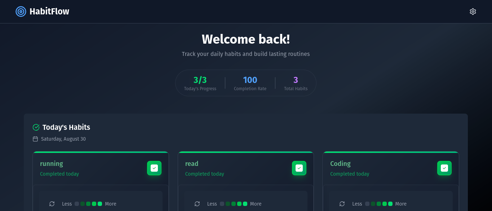

# HabitFlow — Track. Improve. Transform.

**HabitFlow** is a full-stack, open-source habit tracker designed for developers who appreciate clean UIs, meaningful data, and the occasional green square.

Inspired by GitHub’s contribution graph, HabitFlow helps you build daily routines and stick with them — without the bloat.

---

## What it does

- Visualizes daily habit completion using a contribution-style grid
- Tracks multiple habits with daily toggles
- Displays real-time stats including streaks and completion rate
- Built with modern, scalable technologies

---

## Tech Stack

- **Frontend:** React + Tailwind CSS
- **Backend:** Spring Boot 3.5 (REST API)
- **Database:** PostgreSQL (via Docker)
- **Extras:** MapStruct, Spring Security, OpenAPI, Lucide Icons

---

## Getting Started

### Prerequisites

- Node.js (v18+)
- Java 17
- Docker + Docker Compose

---

### Run the App

You can run the full stack with a few simple commands.

```bash
# 1. Start database and Admire UI with Docker
docker-compose up -d

# 2. Start the backend (Spring Boot)
cd backend
./mvnw spring-boot:run

# 3. Start the frontend (Vite + React)
cd ../frontend
npm install
npm run dev

# 4. Open the app in your browser
http://localhost:5173

```

## Features

- **GitHub-style Habit Grid** – Visualize daily completions with color-coded intensity
- **Track Multiple Habits** – Add, toggle, and monitor habits day-by-day
- **Live Stats** – Get your daily progress, streak count, and completion percentage
- **Modern UI** – Responsive, dark-themed design using Tailwind CSS
- **Real-Time Data** – Optimized updates and interactions via React hooks
- **Backend API** – Secure and scalable Spring Boot RESTful API

## 📸 Screenshots



## Contributing

Contributions are welcome — whether it's a bug fix, new feature, or even just cleaning up code.

```bash
# Fork the project

git clone https://github.com/your-username/habitflow.git

# Create a new feature branch

git checkout -b feature/your-feature-name

# Commit and push

git commit -m "Add your change"
git push origin feature/your-feature-name
```

## Open a Pull Request

Please open an issue first if you're planning something big — let's discuss before building.

## License

MIT License © Devcom33
Feel free to use, modify, and distribute this app.

🌟 Support the Project

If you like HabitFlow:

⭐ Star this repo

🍴 Fork it to build your own version

🧑‍💻 Share it with other developers

💬 Give feedback or open feature requests

Let's make habit tracking better together!

## Contact

Questions? Ideas? Open an issue or reach out on GitHub.

Built with 💚 by https://github.com/devcom33
