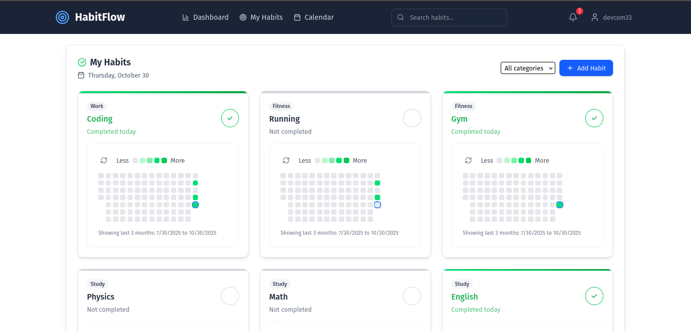

# HabitFlow — Track. Improve. Transform.

A clean, full-stack, open-source app to build consistent habits — with a **GitHub-style progress grid**, daily streaks, and beautiful stats.

## Overview

**HabitFlow** is your personal companion for mastering habits and tracking progress — inspired by GitHub’s contribution grid. Whether you're building a new routine or breaking an old one, HabitFlow helps you stay motivated and accountable.

Built using:

- ⚛️ **React** + Tailwind CSS (Frontend)
- 🧰 **Spring Boot** (Backend)
- 🐘 **PostgreSQL** (Database)

---

## Features

- **GitHub-style Habit Grid** – Visualize daily completions with color-coded intensity
- **Track Multiple Habits** – Add, toggle, and monitor habits day-by-day
- **Live Stats** – Get your daily progress, streak count, and completion percentage
- **Modern UI** – Responsive, dark-themed design using Tailwind CSS
- **Real-Time Data** – Optimized updates and interactions via React hooks
- **Backend API** – Secure and scalable Spring Boot RESTful API

## 📸 Screenshots

🤝 Contributing

We love contributors! 💙 Whether you want to fix a bug, improve performance, or add a new feature, we welcome all contributions.

🧩 How to Contribute

Fork the project

Create a new branch: git checkout -b feature/amazing-feature

Commit your changes: git commit -m 'Add amazing feature'

Push to the branch: git push origin feature/amazing-feature

Open a Pull Request

Check issues to get started.

📄 License

MIT License © Devcom33
Feel free to use, modify, and distribute this app.

🌟 Support the Project

If you like HabitFlow:

⭐ Star this repo

🍴 Fork it to build your own version

🧑‍💻 Share it with other developers

💬 Give feedback or open feature requests

Let's make habit tracking better together!

📬 Contact

Questions? Ideas? Open an issue or reach out on GitHub.

Built with 💚 by Devcom33
